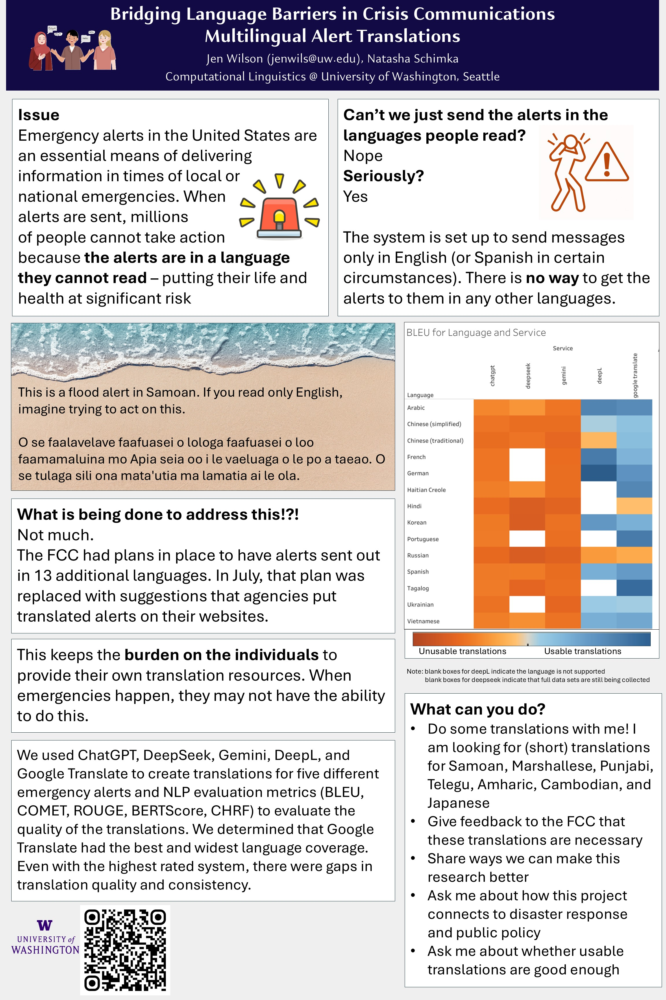

### Invited talk

*Multilingual Emergency Alerts Translation and Accessibility*. Language & Accessibility for Alert & Warning Workgroup September 2025 meeting.

### Poster
*Bridging Language Barriers in Crisis Communications: Multilingual Alert Translations*. RAISE Winter Exposition. Seattle WA, October 2025.

