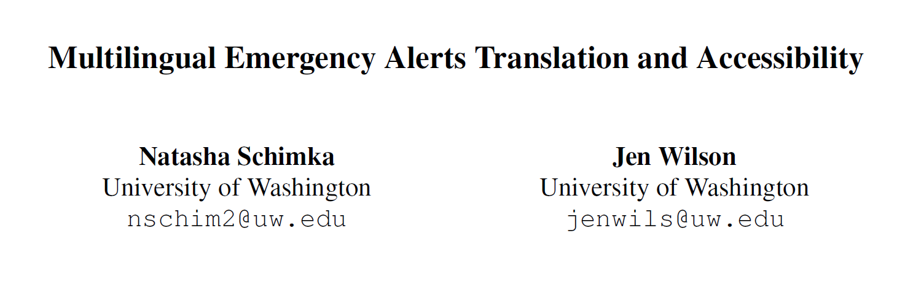

Emergency alerts in the United States are an essential means of delivering important information in the case of a local or national emergency. These messages are sent in English, which means that millions of people are not receiving alerts in languages they can understand, putting their life and health at significant risk. In this paper, we examine the language and associated risk gaps with current emergency alert systems and evaluate solutions to improve reach. We assessed machine-generated translations of emergency messages using BLEU, COMET, BERTScore, and ROUGE to compare the performance of DeepSeek, Gemini, ChatGPT, and Google Translate. We find that overall Google Translate has the most reliable performance.
