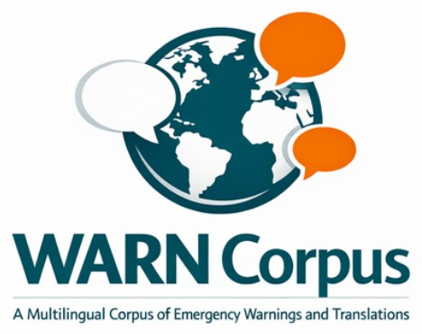
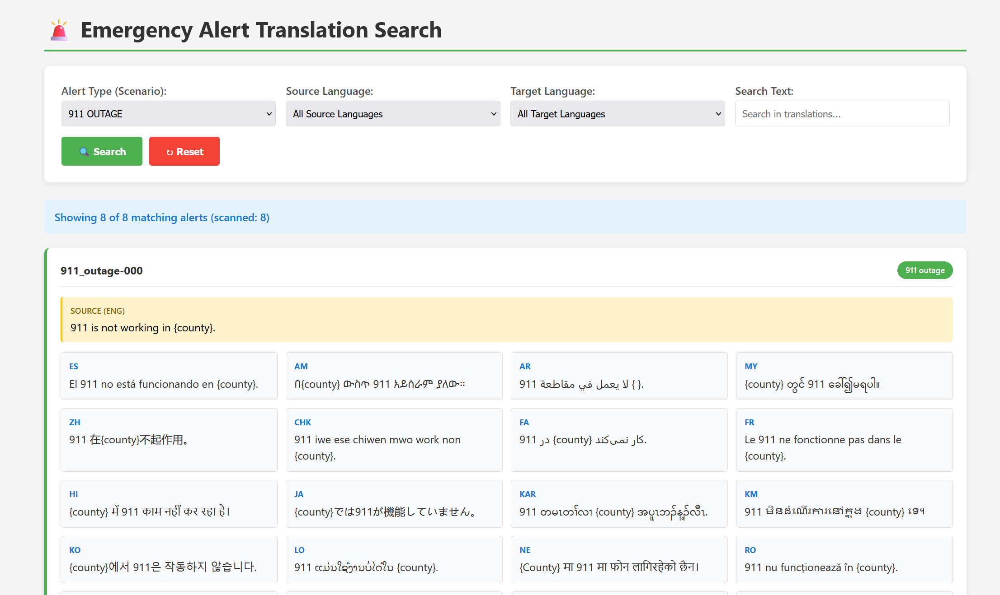

## Browse the dataset

Explore the WARN Corpus through our interactive demo site, where you can search and filter translated alerts by target language and alert type. This allows you to browse the corpus and see how emergency warnings are translated across different languages and contexts.

### [Translated Alert Search](https://zepam.github.io/TranslationToolEvaluation/){:target="_blank" rel="noopener noreferrer"}

<strong>Example:</strong>

