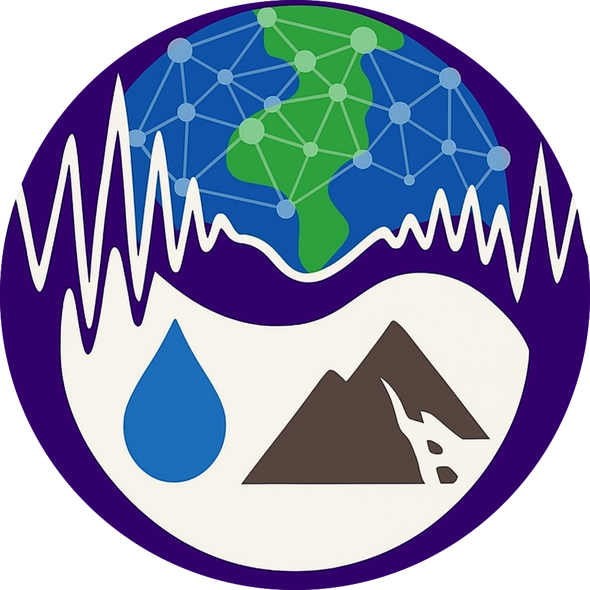

The repo for this is private while we get it ready for public use.

In the mean time, check out other work being done in the [Denolle Lab at the University of Washington](https://denolle-lab.github.io/)
  

